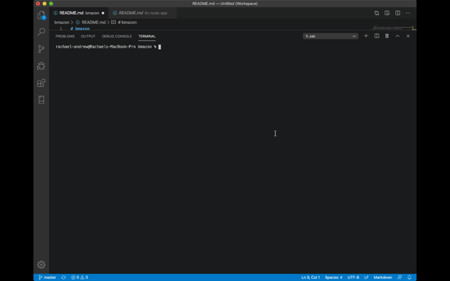

# bmazon

Welcome to Bmazon! This Amazon-like store front is a CLI node application created using MySQL database and javascript. 

Bmazon features three different CLI(s) depending which .js file is opened using node. 

1. bmazonCustomer.js - running this file in terminal with node will open the user side of the store front. It will display products and allow customers to make purchases. It also pushes changes to stock_quantity based on customer purchases. 

2. bmazonManager.js - running this file in terminal with node will open the interface for the manager to 'view products', 'view low inventory', 'add to inventory', or 'add a new product'. 

3. bamzonSupervisor.js - running this file in terminal with node will open the interface for the supervisor to 'view product sales by department' or 'add a new department'.

---------------------------------------------------------------------

To use bmazon, you will need node installed. Recommended SQL database is MySQL, but a database server compatible with MySQL is required.
Once you have downloaded the repo, start by putting bmazonSeeds.sql into your MySQL database. 
Feel free to change the INSERT INTO to your own products, but pay attention to the required columns and and column types to ensure proper insert. 

You will also need the following node packages installed. 

mysql: "version": "2.18.1"
inquirer: "version": "7.0.5"
inquirer-confirm: "version": "2.0.7"

(If you run into issues running a higher package, simply roll back to this version of the npm packages)

You will also need to change the password for the MySQl connection and possibly the user to your information in each of the .js files. 

-----------------------------------------------------------------------

bmzonCustomer Example:

</img>

bmazonManager Example:

</img>

bmazonSupervisor Example: 

</img>

